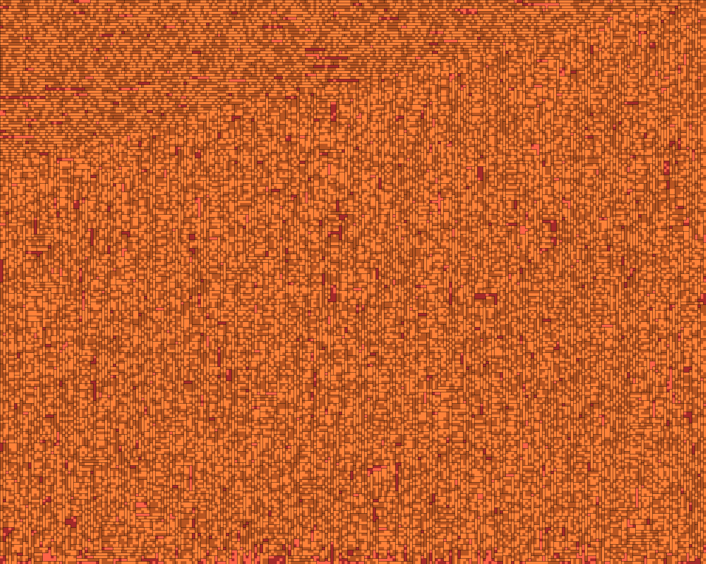

# Google Hashcode - [Pizza Problem](http://bytefreaks.net/google/practice-problem-for-google-hash-code-2017)

This morning we sat together and solved the hashcode practice problem.
We implemented two solutions. A [very simple one](./splitter_algorithm.rb), 
and [a more sophisticated one](./magic_algorithm.rb).

As a goodie we can also view our pizza cuts rendered in an image. This one was solved with the *magic algorithm*:

If you're interested into a very nice test, have a look at the [slice spec](./spec/slice_spec.rb).

## Team

If you want to know who racketeered this... We, the jamps, did

